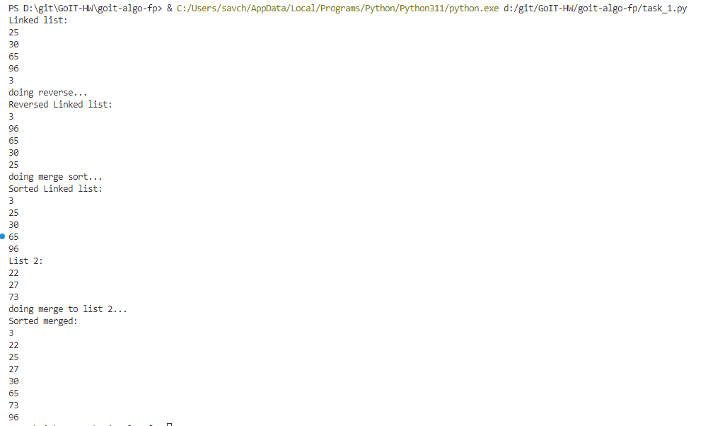
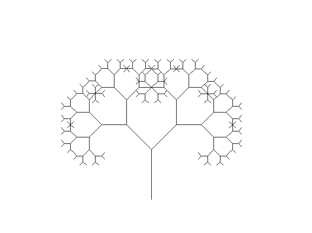
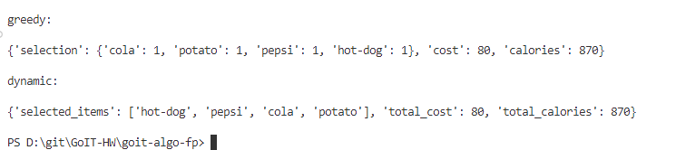
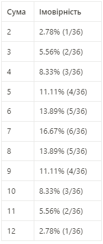
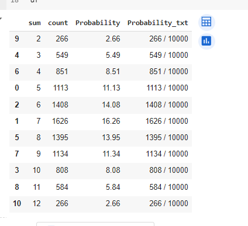
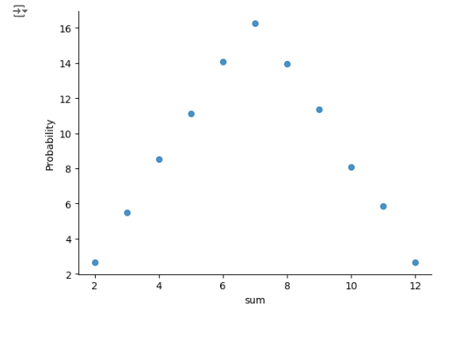

**TOC**

- [Task 1 - Структури даних. Сортування. Робота з однозв'язним списком](#task-1---структури-даних-сортування-робота-з-однозвязним-списком)
    - [Summary](#summary)
- [Task 2 - Рекурсія. Створення фрактала “дерево Піфагора” за допомогою рекурсії](#task-2---рекурсія-створення-фрактала-дерево-піфагора-за-допомогою-рекурсії)
    - [Summary](#summary-1)
- [Task 6 - Жадібні алгоритми та динамічне програмування](#task-6---жадібні-алгоритми-та-динамічне-програмування)
    - [Summary](#summary-2)
- [Task 7 - Використання методу Монте-Карло](#task-7---використання-методу-монте-карло)
    - [Summary](#summary-3)


# Task 1 - Структури даних. Сортування. Робота з однозв'язним списком


Для реалізації однозв'язного списку (приклад реалізації можна взяти з конспекту) необхідно:

написати функцію, яка реалізує реверсування однозв'язного списку, змінюючи посилання між вузлами;
розробити алгоритм сортування для однозв'язного списку, наприклад, сортування вставками або злиттям;
написати функцію, що об'єднує два відсортовані однозв'язні списки в один відсортований список.

## Summary

Результат виконання



# Task 2 - Рекурсія. Створення фрактала “дерево Піфагора” за допомогою рекурсії


Необхідно написати програму на Python, яка використовує рекурсію для створення фрактала “дерево Піфагора”. Програма має візуалізувати фрактал “дерево Піфагора”, і користувач повинен мати можливість вказати рівень рекурсії.

## Summary

Приклад на рівні 8:




# Task 6 - Жадібні алгоритми та динамічне програмування

Необхідно написати програму на Python, яка використовує два підходи — жадібний алгоритм та алгоритм динамічного програмування для розв’язання задачі вибору їжі з найбільшою сумарною калорійністю в межах обмеженого бюджету.

Кожен вид їжі має вказану вартість і калорійність. Дані про їжу представлені у вигляді словника, де ключ — назва страви, а значення — це словник з вартістю та калорійністю.

```python
items = {
    "pizza": {"cost": 50, "calories": 300},
    "hamburger": {"cost": 40, "calories": 250},
    "hot-dog": {"cost": 30, "calories": 200},
    "pepsi": {"cost": 10, "calories": 100},
    "cola": {"cost": 15, "calories": 220},
    "potato": {"cost": 25, "calories": 350}
}
```

Розробіть функцію greedy_algorithm жадібного алгоритму, яка вибирає страви, максимізуючи співвідношення калорій до вартості, не перевищуючи заданий бюджет.

Для реалізації алгоритму динамічного програмування створіть функцію dynamic_programming, яка обчислює оптимальний набір страв для максимізації калорійності при заданому бюджеті.

## Summary

Приклад результату (для розрахунку оптимального використовувалось ratio cost/calories)



# Task 7 - Використання методу Монте-Карло

Необхідно написати програму на Python, яка імітує велику кількість кидків кубиків, обчислює суми чисел, які випадають на кубиках, і визначає ймовірність кожної можливої суми.

Створіть симуляцію, де два кубики кидаються велику кількість разів. Для кожного кидка визначте суму чисел, які випали на обох кубиках. Підрахуйте, скільки разів кожна можлива сума (від 2 до 12) з’являється у процесі симуляції. Використовуючи ці дані, обчисліть імовірність кожної суми.

На основі проведених імітацій створіть таблицю або графік, який відображає ймовірності кожної суми, виявлені за допомогою методу Монте-Карло.
Таблиця ймовірностей сум при киданні двох кубиків виглядає наступним чином.



Порівняйте отримані за допомогою методу Монте-Карло результати з аналітичними розрахунками, наведеними в таблиці вище.

## Summary

На запуску 36 результати постійно стрибали бо ми працюємо з малою вибіркою

Але на 1000 і 10,000 спробах результати приходять до пірамідального випадку, де найчастіше випадає те що в середині діапазону



Розподіл



В звязку з даним спостереженням можна зробити висновок що метод Монте-Карло працює якщо достатньо сильно збільшити вибірку даних, і при великій кількості спостережень цього достатньо щоб побачити реальний розподіл імовірностей.